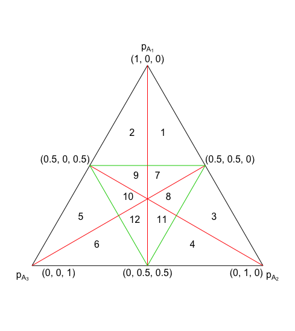

# Desempate Técnico

Arquivos e funções utilizadas na dissertação de Filipe Zabala (2009) - Desempate Técnico.

## Instalação
```r
# Instalando pacotes
packs <- c('devtools','VGAM','klaR')
new.packages <- packs[!(packs %in% installed.packages()[,"Package"])]
if(length(new.packages)) install.packages(packs, dep=TRUE)
update.packages(checkBuilt = TRUE, ask = FALSE)
devtools::install_github('filipezabala/desempateTecnico', force = T)
library(desempateTecnico)
```

## Exemplos
### `bayes`
```r
bayes( c(.4,.3,.3), 1000)
#' bayes( c(.3,.25,.2,.1,.05), 100)
#' bayes(rep(1/5,5), 500)
#' bayes( c(.5813972562, .3158114522, .1027912917), 50)
#' bayes( c(.5144202347, .3246860305, .1608937348), 100 )
#' bayes( c(.4160925601, .3316216347, .2522858052), 500 )
#' bayes( c(.3919345050, .3324785813, .2755869137), 10^3 )
#' bayes( c(.3518464606, .3332479566, .3149055828), 10^4 )
#' bayes( c(.3391808234, .3333247966, .3274943799), 10^5 )
#' bayes( c(.3333333335, .3333333333, .3333333331), 10^20 )
```

### `simplex2d`
```r
simplex2d()
```


### `simplex3d`
```r
simplex3d(.4, .3, .3, 1000)
```
.png)
```r
simplex3d(.5144202347, .3246860305, .1608937348, 100)
```
.png)

